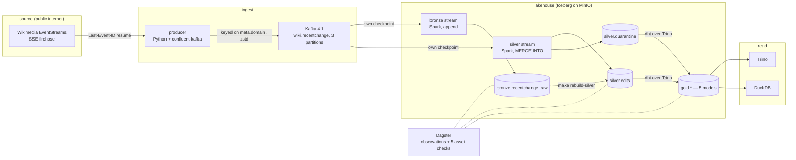

# wikistream-lakehouse

[](LICENSE)
[](pyproject.toml)

A real-time lakehouse: Wikipedia's live edit stream into Kafka, Spark Structured
Streaming into Apache Iceberg, dbt marts over Trino, orchestrated by Dagster —
running end to end on a laptop.

## What this is

Wikimedia publishes every edit made across all its wikis as a public
Server-Sent-Events firehose. This repository consumes that firehose and turns it
into a queryable lakehouse on a single machine: a Python producer publishes each
event verbatim to Kafka, Spark Structured Streaming lands it in Apache Iceberg
tables on MinIO, dbt builds analytics marts over Trino, and Dagster models the
whole thing as assets with checks.

It exists to demonstrate the parts of data engineering that are hard to get
right rather than hard to wire up: duplicate suppression in a table format that
has no primary keys, late-arriving events, restart safety under a hard kill,
schema evolution, and the small-files problem that streaming into a lakehouse
creates. Each of those is checked by a command rather than asserted in prose —
see [docs/correctness.md](docs/correctness.md).

## What it looks like

`make query` runs three statements through Trino against the tables Spark is
writing. This is its output, captured on 2026-09-18 at 02:25 UTC, about seventy
minutes after `make up` on an empty lakehouse:

```
── 1. Trino sees the tables Spark wrote
   One catalog, two engines, no copy. Spark commits; Trino reads the commit.

 namespace |        table_name        | columns
-----------+--------------------------+---------
 bronze    | recentchange_raw         |      10
 gold      | dim_wikis                |      17
 gold      | mart_bot_vs_human_hourly |      12
 gold      | mart_edits_per_minute    |      11
 gold      | mart_pipeline_health     |      17
 gold      | mart_top_pages_hourly    |      10
 gold      | stg_edits                |      22
 gold      | stg_quarantine           |       7
 silver    | edits                    |      22
 silver    | quarantine               |       7
(10 rows)

── 2. Row counts across the three tables
   bronze and silver are independent consumers of the same topic, so the
   gap between them is consumer progress and nothing else.

 bronze_rows | silver_rows | silver_distinct_ids | quarantined_rows
-------------+-------------+---------------------+------------------
      139552 |      139552 |              139552 |                0
(1 row)
   Neither count bounds the other: whichever stream ran last is ahead.

── 3. Iceberg metadata, read through Trino's $-suffixed tables
   Snapshot history is part of the table, not a side file. This is the audit trail.

     snapshot_id     | operation | age_seconds | total_records | data_files
---------------------+-----------+-------------+---------------+------------
 2984875761198345813 | append    |           6 |        139552 |        552
 8753989008184389861 | append    |          37 |        138593 |        548
 5967489729180078399 | append    |          66 |        137583 |        544
 7369824866906420086 | append    |          96 |        136644 |        540
 8764484574524682762 | append    |         127 |        135552 |        536
(5 rows)
```

`silver_distinct_ids` equalling `silver_rows` is the whole point of the project,
and it has its own command — [Correctness](#correctness) below. The two streams
happen to be level here; they usually are not, and section 2 says why.

## Quickstart

Everything runs in local Docker. Nothing is created in any cloud, no API key is
needed, and the only credential in the repository is MinIO's documented default.

**Prerequisites**

| What | Why |
|---|---|
| Docker Engine with Compose v2 | Every service is a container. |
| 10 GB of RAM available to Docker | Measured peak across the full stack is 6,974 MiB. `make bootstrap` warns between 6 and 10 GB and fails below 6. |
| 20 GB free on the Docker root | Nine images — four built here (4.63 GB by `docker images`) and five pulled. Summing unique layers from `docker system df -v` and counting each shared base once puts the real footprint near 8.6 GB, and Docker's build cache is a few GB on top. Kafka then adds 1.40 GB per day of retention. `make bootstrap` checks for 20. |
| Free ports 3000, 4040, 8080, 8181, 9000, 9001, 9092 | One per service — [what answers on each](#operations). Every one is a variable in `.env`. |
| An outbound HTTPS connection | The source is a live public stream. |

```bash
git clone https://github.com/william-sarkar/wikistream-lakehouse.git
cd wikistream-lakehouse
cp .env.example .env      # every value has a working default; nothing is secret
make bootstrap            # checks Docker, RAM, disk and ports before you commit to it
make up                   # 2m28s with images built; a first run builds them first
make init-tables          # 19s — creates both namespaces and both Iceberg tables
make ingest               # starts the producer as a restarting background service
```

Then two long-running commands, each in its own terminal:

```bash
make stream-bronze        # append-only, 30-second trigger
make stream-silver        # MERGE INTO, deduplicating on event_id
```

The first Iceberg commit lands 9 seconds after `make stream-bronze` starts, so
about **three minutes from `make up` to queryable data** on this machine once the
images exist. Building the four of them from nothing is the slow part and it is
worth knowing before you start: `docker compose build --no-cache` took **22m50s**
here, most of it `apt-get` and `pip` inside the Spark image on a residential
connection. Budget half an hour for a first run and three minutes for every one
after it. Then:

```bash
make query                # the output shown above
make table-stats          # row counts, file counts, sizes, snapshot counts
make verify-no-duplicates # the zero-duplicate proof
make dbt-build            # 7 models and 62 tests through Trino
make dagster-observe      # observe the tables and run their 5 asset checks
make down                 # stop everything, keep the data
```

`make` on its own lists every target with a one-line description. There are 62 of
them and that list is the interface — nothing in this README asks you to run a
script by path.

**If 10 GB is not available.** `make up-core` starts Kafka, MinIO, the Iceberg
catalog and Spark and skips Trino and Dagster, which are the two largest
consumers. Everything up to and including both Iceberg tables works, the whole
integration suite runs, and `make query-duckdb` reads the same tables with DuckDB
in-process — no JVM, no configuration — so the low-memory path still ends with
data on screen rather than with an apology.

## Architecture



Why each piece is there, one paragraph each. The longer version, including the
substitution table for the same design on AWS and on GCP, is
[docs/architecture.md](docs/architecture.md).

**The producer** exists to turn an HTTP connection into a replayable log. It holds
one long-lived SSE connection, sets a `User-Agent` naming the project because that
is what Wikimedia asks of clients, resumes with `Last-Event-ID` after a drop, and
backs off from 1 s to a 60 s cap. It publishes each frame **verbatim** — no
parsing, no enrichment — because the moment the producer interprets a payload, the
raw record is gone and bronze stops being an audit log.

**Kafka** is the buffer that makes everything downstream restartable. Without it,
killing the Spark job loses whatever arrived while it was dead; with it, the job
resumes from a committed offset and the gap closes by itself. It is also the only
component here whose absence would make the central proof — restart with no
duplicates and no loss — impossible to stage.

**Spark Structured Streaming** writes both Iceberg tables, in two independent
queries reading the same topic. Bronze appends everything, including frames it
could not parse. Silver applies the expectation rules and `MERGE INTO`s the
survivors on `event_id`, sending failures to a quarantine table with the reason
and their Kafka coordinates. Two consumers rather than a chain is a deliberate
choice with a measurable consequence, explained in
[docs/architecture.md](docs/architecture.md#why-kafka-has-two-arrows-out-of-it).

**Iceberg** is what makes the storage a lakehouse rather than a directory of
Parquet: atomic commits, so a reader never sees half a write; `MERGE INTO`, which
is where the deduplication guarantee lives; snapshot history as a queryable table,
which is why every file-count figure in this README is a `SELECT` rather than a
claim; and hidden partitioning, so bronze can partition by ingest date and silver
by event date without a single query naming a partition column.

**MinIO** is the object store, one container, with the S3 API that Iceberg's
`S3FileIO` speaks. It is here rather than a local directory because object-storage
semantics are what make the small-file problem and the request-cost arithmetic in
[docs/cost.md](docs/cost.md) real rather than hypothetical.

**Trino** is the engine dbt compiles against. It reads the Iceberg catalog Spark
commits to — no copy, no sync job, no export — which is the interoperability claim
that `make query` (Trino) and `make query-duckdb` (DuckDB, a third engine with no
JVM and no configuration in this repository) exist to check from two runtimes.
Asked the same question on 2026-09-18 at 03:37 UTC, with both streaming jobs stopped
so the answer could not move between engines:

| Engine | `count(*)` on `silver.edits` | Asked with |
|---|---|---|
| Spark 4.0.4 — the process that wrote the table | 222,410 | `make sql SQL="…"` |
| Trino 483 | 222,410 | `make query` |
| DuckDB 1.5.5, in this repository's Python process | 222,410 | `make query-duckdb` |

One copy of the bytes in MinIO, three readers, nothing exported in between.
`test_duckdb_reads_the_same_tables_and_agrees_on_the_counts` in
[tests/integration/test_silver_rebuild.py](tests/integration/test_silver_rebuild.py)
asserts that equality on the fixture-fed tables, so it is a test rather than a
number that was true once.

**dbt** owns the analytics layer: two staging views over silver, then four marts
and one dimension in `gold`, with 62 tests. Each mart chooses its incremental
strategy from the shape of its aggregate rather than from a house style, which is
[ADR-0028](DECISIONS.md#adr-0028--choose-each-marts-incremental-strategy-from-the-shape-of-its-aggregate).

**Dagster** is the control plane, and it does not run the streams. The Wikimedia
feed, the Kafka topic and the three Iceberg tables are *external assets* — real
nodes with real edges that Dagster observes and never materialises — because
scheduling a process that is already running continuously is a fiction, and a graph
that lies about who runs what is worse than no graph. What Dagster does own: the
observations themselves, the dbt build with its tests as asset checks, the gold
maintenance job, and five checks of its own.

## The problem, and the constraints

The problem I set myself: build the streaming and lakehouse half of a data
platform properly, on a laptop, with no cloud bill and no synthetic data — and
prove the parts that are usually only claimed.

Synthetic data was the tempting shortcut and it is the one that would have made
the result worthless. If I generate the events, I choose the lateness
distribution, so any watermark I pick is trivially correct and a reviewer knows
it ([ADR-0002](DECISIONS.md#adr-0002--a-real-time-lakehouse-not-a-batch-elt-project)).
A live public firehose supplies real duplicates on reconnect, real out-of-order
arrival, real schema variation between event types and real diurnal rate changes,
at no cost. It also supplies the constraint that the hardest test needs the
internet, which is why the suite is split by marker: 382 of the 389 tests never
open a socket to Wikimedia, and the seven that do are the restart proof.

The constraints that shaped every other decision:

| Constraint | Consequence |
|---|---|
| Zero running cost | No managed service anywhere. The AWS module is validated and never applied; the price of running it is [computed instead](docs/cost.md), from the public price list. |
| One 11 GB laptop | Trino and Dagster sit behind a profile flag, Spark runs `local[*]` with a 1 GB driver heap, and Kafka retention is 24 hours rather than a week. |
| The source is someone else's service | One connection, exponential backoff, a descriptive `User-Agent`, no polling, no scraping. |
| A stranger must be able to run it | Every version is pinned and was checked against the registry rather than remembered ([ADR-0003](DECISIONS.md#adr-0003--the-version-pin-set-verified-rather-than-assumed)); jars are baked into the image so a cold start is not a 115 MB Maven download. |
| No secrets, ever | The only credential is MinIO's documented default. `gitleaks` runs in CI and in pre-commit. |

## Design decisions

Every row links to a record that names what was rejected and why. There are 47 of
them in [DECISIONS.md](DECISIONS.md); these are the eleven a reviewer is most likely
to want to argue with.

| Decision | Chose | Rejected | Why, in one line |
|---|---|---|---|
| Queue | Kafka 4.1.2, KRaft | Redpanda, Kinesis, no queue at all | Redpanda would have cost less memory and removed the Kafka operational surface I want to be able to discuss. [ADR-0040](DECISIONS.md#adr-0040--kafka-over-redpanda-and-kraft-because-there-is-no-longer-a-choice) |
| Table format | Iceberg 1.10.1 | Delta Lake, Hudi, bare Parquet | Queryable snapshot metadata, hidden partitioning, `MERGE INTO`, and the widest set of readers — this repo reads the same bytes from three engines. [ADR-0041](DECISIONS.md#adr-0041--iceberg-over-delta-lake-and-hudi) |
| Stream processor | Spark Structured Streaming 4.0.4 | Flink, Kafka Streams, a PyIceberg consumer | Flink's advantage is latency this workload does not need, and its dedup pattern moves the guarantee from a SQL statement into state I would have to be trusted about. [ADR-0042](DECISIONS.md#adr-0042--spark-structured-streaming-over-flink) |
| Orchestrator | Dagster | Airflow, Prefect, Temporal | I use Airflow daily; it would have demonstrated something my CV already claims, and it models "a table someone else is continuously writing" badly. [ADR-0043](DECISIONS.md#adr-0043--dagster-over-airflow-deliberately-and-against-the-market) |
| Mart engine | Trino 483 | Spark SQL, DuckDB, ClickHouse | One engine writing and reading makes "the storage is open" unfalsifiable; and Athena *is* Trino, so the AWS port is an adapter swap. [ADR-0044](DECISIONS.md#adr-0044--trino-as-the-engine-dbt-compiles-against) |
| Object store | MinIO | LocalStack, `moto`, a local directory | LocalStack would let the repository imply its never-applied Terraform had been run. A local directory would delete the request-cost story. [ADR-0045](DECISIONS.md#adr-0045--minio-over-localstack-for-the-object-store) |
| Deduplication | `MERGE INTO` inside `foreachBatch` | `dropDuplicatesWithinWatermark`, the Iceberg streaming sink | State-based dedup forgets after the watermark; a `MERGE` against the table's own contents does not, so it survives a restart, a replay and a rebuild. [ADR-0020](DECISIONS.md#adr-0020--merge-into-inside-foreachbatch-not-the-iceberg-streaming-sink) |
| Silver watermark | none at all | 10 minutes, matching bronze | A watermark exists to bound state. `MERGE` keeps no state, so a watermark on silver would only drop late rows — and `tests/spark/test_watermark_would_drop_data.py` measures how many. [ADR-0019](DECISIONS.md#adr-0019--no-watermark-on-the-silver-stream) |
| Kafka partitioning | key on `meta.domain` | round-robin, or key on `event_id` | Per-wiki ordering is worth the skew, and the skew is measured rather than hoped away: `make explain-partitions`. [ADR-0008](DECISIONS.md#adr-0008--partition-kafka-by-wiki-domain-accepting-the-skew) |
| Gold consistency | one ingest-time cutoff per dbt run | `severity: warn`, Iceberg time travel, serialising the graph | The input changes while the DAG runs; pinning the staging views instead would freeze what an ad-hoc query sees until the next build. [ADR-0046](DECISIONS.md#adr-0046--bound-every-gold-model-on-one-ingest-time-cutoff-per-dbt-run) |
| Compression | zstd | gzip, which measured 4.5% better | That 4.5% is inside run-to-run variance, so the ratio does not decide it; zstd has a tunable level and gzip does not. CPU was not measured, and [docs/throughput.md](docs/throughput.md) says so. [ADR-0014](DECISIONS.md#adr-0014--zstd-for-topic-compression-though-gzip-measured-better) |

## Data contracts

Three layers, three contracts, each with a different job. The column-by-column
version, including what happens to every field of a `recentchange` event, is
[docs/data-contracts.md](docs/data-contracts.md).

| | `bronze.recentchange_raw` | `silver.edits` | `gold.*` |
|---|---|---|---|
| Guarantee | everything that arrived, unmodified | one row per `event_id`, every expectation met | aggregates, tested |
| On a bad row | keep it, with null extractions | route to `silver.quarantine` with a reason | n/a |
| Key | none — it is a log | `event_id` | per model |
| Partitioned by | `ingest_date` | `event_date` | per model |
| Written by | the bronze stream | the silver stream, `rebuild_silver.py` | dbt |
| Nullable event time | yes | no | no |

The two rules that matter most in practice. **Bronze never rejects anything**: an
unparseable frame lands with its payload intact and its extracted columns null, so
the raw bytes are always recoverable and every downstream layer can be rebuilt
from them. **Silver is permissive but explicit**: parsing uses `try_*` functions
with ANSI mode left on, so a malformed field produces a null rather than a failed
batch, and the expectation rules — not the parser — decide whether a row is
acceptable ([ADR-0018](DECISIONS.md#adr-0018--keep-ansi-mode-on-and-parse-with-try_-rather-than-disabling-it)).

The polymorphic `log_params` field stays as raw JSON text rather than being
coerced into a struct, because its shape depends on the log action and a struct
would either lose fields or invent them
([ADR-0006](DECISIONS.md#adr-0006--keep-the-polymorphic-log_params-as-raw-json-text)).

## Correctness

Six properties, each with a command. The arguments behind them are in
[docs/correctness.md](docs/correctness.md).

**1. Zero duplicates, proven not asserted.**

```console
$ make verify-no-duplicates

lakehouse contents
  bronze.raw rows                140,533
  bronze.raw repeated ids              0   (expected: it is an audit log)
  silver.edits rows              140,533
  silver.quarantine rows               0

checks
  [pass] silver.edits duplicate event_id        observed          0  expected 0
  [pass] silver.edits null event_id             observed          0  expected 0
  [pass] silver.edits null event_time           observed          0  expected 0
  [pass] silver.quarantine duplicate kafka offset observed          0  expected 0
  [pass] silver.edits is empty                  observed          0  expected 0

all 5 checks passed
```

It exits non-zero on any failure, so it is usable in CI and in the acceptance
script rather than being a thing a human reads.

**2. The same holds after a hard kill.** `make test-e2e` starts both streams,
lets them commit, kills the Spark process with `pkill -9` mid-flight, deletes a
checkpoint commit file to force a genuine replay of an already-committed batch
([ADR-0025](DECISIONS.md#adr-0025--make-the-crash-window-deterministic-by-deleting-commitsn)),
restarts, and asserts zero duplicate `event_id`s afterwards. That is the test the
whole design exists to pass: at-least-once delivery from the source, exactly-once
effect in the table.

**3. Late data is kept, and the cost of not keeping it is measured.** Silver has
no watermark, so an event that arrives an hour late still merges. To show that
this is a decision rather than an omission,
`tests/spark/test_watermark_would_drop_data.py` replays a captured window through
a watermarked query and counts the rows it would have dropped. The lateness
distribution the choice is based on — including the p99 that a 10-minute
watermark on bronze is sized against — is measured by `make measure-lag` and
written up in [docs/latency.md](docs/latency.md).

**4. Schema evolution costs nothing.** `make prove-schema-evolution` adds,
renames, widens and drops a column on a scratch table and shows that no data file
was rewritten — Iceberg's schema changes are metadata operations, and the proof is
the unchanged file list rather than the absence of an error.

**5. Nothing was lost between the queue and the table.** The Dagster check
`bronze_offsets_are_contiguous` compares bronze's per-partition offset ranges
against Kafka's own end offsets. It deliberately does *not* compare bronze's row
count to silver's: the two streams commit independently, so they disagree several
times an hour while nothing is wrong, and a check that fires when nothing is wrong
is a check a team learns to ignore.

**6. The analytics layer reads one consistent view of a table that is moving.**
This one is in the list because it broke. A `dbt build` takes 72 seconds, silver
gains a snapshot every 30, and dbt builds models on four threads — so
`mart_top_pages_hourly` and `dim_wikis` were reading different snapshots, and the
day a Belarusian Wiktionary edit arrived between the two builds, the foreign key
between them failed with three rows. Both models were correct. The reference
between them was broken by the clock. Every gold model now bounds itself on one
ingest-time cutoff per dbt invocation, `dim_wikis` publishes the cutoff it was
built to as a column, and `tests/unit/test_dbt_run_cutoff.py` fails the build if a
new model forgets — statically, because the failure needs a wiki to be born at the
right second and a test that can only fail by luck protects nothing.
[ADR-0046](DECISIONS.md#adr-0046--bound-every-gold-model-on-one-ingest-time-cutoff-per-dbt-run)
has the query that diagnosed it and the five alternatives I rejected, one of which
was setting the test to `warn`.

## Testing and CI

389 tests, split by marker so that each layer runs where it can:

| Marker | Count | Needs | Runs in CI |
|---|---|---|---|
| `unit` | 285 | nothing — no network, no Docker, no JVM | yes |
| `spark` | 75 | a JDK and in-process Spark | yes |
| `integration` | 22 | `make up-core` | yes, with the core profile |
| `e2e` | 7 | `make up-core`, the internet, and 4 minutes | nightly, not per commit — it is the restart proof |

`make test` runs the first three. The split matters because it decides what a
contributor can check before pushing: 285 tests need nothing but Python, which is
what makes the pre-commit hook worth having.

Three of the suites are less obvious than the rest and are the ones I would point
at in an interview. `tests/spark/test_expectation_parity.py` asserts that
the Python expectation rules and the Spark SQL that enforces them agree on the
same captured frames, because the same rule expressed twice is the classic place
for a silent divergence
([ADR-0022](DECISIONS.md#adr-0022--the-parse-verdict-is-sparks-alone-only-the-rules-have-a-python-twin)).
`tests/unit/test_dagster_jobs.py` asserts that the three jobs partition every
materialisable asset, so an asset added later cannot quietly end up orchestrated
by nothing. `tests/unit/test_dbt_run_cutoff.py` is the third, and it is there
because the bug it guards is not reproducible on demand — see property 6 above.

**CI** is three GitHub Actions workflows, free tier only, no cloud credentials
anywhere in any of them:

- `ci.yml` — `lint` (ruff, mypy, sqlfluff, `dbt parse`, and a link check that
  resolves every relative link and heading anchor in the Markdown, including the
  19 ADR anchors this file points at), `workflow lint` (actionlint, which also
  shellchecks every `run:` block), `unit` with a coverage artefact, `spark`,
  `integration` (sharded, against a real core stack brought up in the runner), and
  `secrets` (gitleaks). Superseded runs are cancelled by a concurrency group;
  every job has a timeout.
- `infra.yml` — `terraform fmt -check`, `init -backend=false`, `validate`, a
  Trivy config scan, and `kubeconform --strict` over every kustomize overlay.
- `nightly.yml` — the two checks that must not be a merge gate, on a schedule
  instead: `make smoke-live`, which fails if the stream carries a field the
  declared schema does not, and the restart proof. Both depend on a public
  endpoint, so a failure there is information about the world rather than a verdict
  on somebody's commit
  ([ADR-0048](DECISIONS.md#adr-0048--run-the-restart-proof-on-a-nightly-schedule-not-on-every-pull-request)).

No workflow can touch AWS: there is no credential, no state file, and no `plan`
step. That is the point of the module — see the banner at the top of
[infra/aws/README.md](infra/aws/README.md).

`.pre-commit-config.yaml` runs the same linters plus gitleaks and a hook that
refuses to stage a private key.

## Operations

[docs/runbook.md](docs/runbook.md) is the real answer: twelve failure modes —
source unreachable, broker down, object store full, poison message, upstream
schema change, corrupted checkpoint, backfill a window, bronze growing without
bound, an opaque catalog error, a changed mart grain, Trino out of memory, an
orphaned stream — each with the symptom, the command that diagnoses it, and the
fix. It opens with a symptom index, because at 3 a.m. you know what you are
seeing, not what it is called.

The everyday commands:

| Question | Command |
|---|---|
| Is anything unhealthy? | `make ps` |
| Are the streams keeping up? | `make kafka-lag` |
| How much data is there, in how many files? | `make table-stats` |
| Are the checks passing? | `make dagster-observe` |
| Are there too many small files? | `make maintain` — compacts, expires snapshots, rewrites manifests, removes orphans |
| Did the marts build? | `make dbt-build` |
| What is upstream doing right now? | `make measure-lag` |
| Is a stream still running from a terminal I closed? | `make stop-streams` — lists what it finds before it stops it |

Every port the stack publishes, and what is listening on it. All seven are
variables in `.env.example`, so a collision with something already running is a
one-line edit rather than a reason the stack will not start:

| Port | `.env` variable | What answers on it |
|---|---|---|
| 3000 | `WS_DAGSTER_PORT` | The Dagster UI: asset graph, check results, run history |
| 4040 | `WS_SPARK_UI_PORT` | The Spark UI of whichever streaming job is running — batch duration and rows per trigger |
| 8080 | `WS_TRINO_PORT` | Trino, both its web UI and the HTTP endpoint dbt and `make query` speak to |
| 8181 | `WS_ICEBERG_REST_PORT` | The Iceberg REST catalog. Every engine resolves table metadata through it |
| 9000 | `WS_MINIO_S3_PORT` | MinIO's S3 API — where the Parquet and the manifests actually live |
| 9001 | `WS_MINIO_CONSOLE_PORT` | The MinIO console, for looking at the objects one commit produced |
| 9092 | `WS_KAFKA_PORT` | Kafka. The only port the producer and both Spark jobs need |

Two operational facts worth knowing before you run it for a day. **The Dagster
schedules ship stopped** — observe every 2 minutes, marts every 15, gold
maintenance at 03:00 — because a laptop that wakes up at three in the morning to
compact a table is a laptop whose owner turns the project off. Start them in the
UI at `localhost:3000` if you want them. And **`make clean` is the only command
that destroys data**; `make down` keeps the volumes, so both streams resume from
their checkpoints with no duplicates and no gap.

## Performance and cost

Every figure below was produced by a command in this repository, on WSL2 with
8 vCPUs and an 11 GB memory allocation, of which the kernel reports 10.7 GB usable,
against the live stream from a residential connection in Dhaka. Regenerate any of
them with `make measure-throughput`, `make measure-lag`, `make measure-resources`,
`make table-stats`, or the SQL quoted below.

### Throughput

| Metric | Value | How |
|---|---|---|
| Sustained ingest, 60-minute window | 44.4 events/s | 159,802 rows landed in bronze between 00:00 and 01:00 UTC on 2026-09-18, divided by 3,600 |
| Short-run rate, 5,000 frames | 51.4 events/s | `make measure-throughput`, 08:16 UTC on 2026-09-17 |
| Same measurement at 03:45 UTC | 40.2 events/s | `make measure-lag` — the source has a diurnal cycle |
| Compression ratio, zstd | 4.33× | 6,841,047 payload bytes against 1,578,825 on the broker |
| Kafka storage | 1.40 GB per day of retention | 316 stored bytes per record at the measured rate |

This is the source's rate, not the pipeline's capacity. The producer's
`backpressure_waits` counter stayed at 0 for the whole run and its send queue sat
at a depth of 1 record, so nothing here is saturated — which also means **this
repository does not know its own ceiling**, and says so rather than extrapolating
one. [docs/throughput.md](docs/throughput.md) has the full method.

### Latency

Two measurements, because "end-to-end latency" is ambiguous and the ambiguity
hides the interesting part. Both are percentiles over the same 60-minute window,
00:00–01:00 UTC on 2026-09-18, computed with `percentile_approx` over every row
that landed in that window — not sampled.

| Measured | p50 | p95 | p99 | max | Rows |
|---|---|---|---|---|---|
| Broker append → queryable in bronze | 15.3 s | 28.9 s | 30.7 s | 33.4 s | 159,802 |
| Wiki event time → queryable in silver | 14 s | 28 s | 30 s | 60 s | 156,060 |

The method, runnable as written — the bronze row of the table above is this
statement:

```bash
make sql SQL="SELECT count(*) AS rows, percentile_approx((unix_micros(ingested_at) - unix_micros(kafka_timestamp)) / 1e6, array(0.5, 0.95, 0.99)) AS p50_p95_p99 FROM lakehouse.bronze.recentchange_raw WHERE ingested_at > current_timestamp() - INTERVAL 60 MINUTES"
```

Run on a different hour — 30,524 rows, three hours after the table above — it
returned `[15.128, 29.032, 30.423]`, which is the same distribution and is the
reason I am willing to quote it.

Silver's row uses `late_by_seconds`, a column the stream computes as
`ingested_at - event_time`. Its minimum over the window was **−2 s**: negative
lateness is clock skew between Wikimedia's clock and this laptop's, and it is worth
knowing about before treating any single-digit latency figure as precise.

**What the distribution says.** p50 at roughly half the trigger interval and p99
at roughly the whole of it is exactly what a uniform arrival rate inside a fixed
30-second micro-batch window looks like. **The latency is the trigger, not the
machine.** A 5-second trigger would divide the latency by roughly six and multiply
the commit rate — and with it the file count — by six. I have not run it at 5
seconds, so that is arithmetic rather than a measurement; what *is* measured is the
money on the other side of the same trade, in
[docs/cost.md](docs/cost.md#what-freshness-costs): 30-second freshness costs
$501.70 a month of AWS compute where 15-minute freshness costs $75.25.

**What it does not say.** Over the whole table — 1,333,294 rows across 14.7 hours
— the same query returns a p50 of 31.9 minutes and a p99 of 7.0 hours. That is not
a contradiction and it is not steady-state performance: it is this laptop being
closed and reopened during development, after which the stream reads a day of
Kafka retention as fast as it can. A percentile over a window that contains a
restart measures the restart. Both numbers are real, only one of them is a
latency, and quoting the whole-table figure as though it were a latency is the
kind of thing this section exists to avoid.

### Memory

`make measure-resources` samples `docker stats` every 10 seconds and keeps the
maximum per container. This is 23 samples over 5 minutes with both streams and the
producer running and no query in flight:

| Container | Peak MiB |
|---|---|
| spark | 2,823 |
| trino | 1,668 |
| kafka | 761 |
| minio | 658 |
| dagster-daemon | 550 |
| iceberg-rest | 283 |
| dagster-webserver | 195 |
| producer | 36 |
| **sum of peaks** | **6,974** |

That total is a sum of peaks, not a peak of sums — no two containers are
guaranteed to hit their maximum at the same instant — so treat it as an upper
bound. It is also the reason `make up-core` exists: dropping Trino and the two
Dagster containers removes 2,413 MiB, which is the difference between fitting in
a 6 GB Docker allocation and not.

### Start-up and shutdown

| Operation | Measured | What state |
|---|---|---|
| `docker compose build --no-cache` | 22m50s | four images from nothing |
| `make up`, cold | 2m28s | empty volumes, images already built |
| `make up`, warm | 2m01s | volumes populated, tables and offsets present |
| `make init-tables` | 19s | fresh catalog |
| `make ingest` | 3s | producer starts as a service |
| First Iceberg commit after `make stream-bronze` | 9s | — |
| `make down` | 45s to 1m21s | both streams live; the spread is Kafka's shutdown flush, 25 minutes of log against a day of it |
| `make clean` | 16s | after `down` |

Warm start is barely faster than cold, which was not what I expected. The cost is
the dependency chain rather than the work: `make up` passes `--wait`, so it returns
only when the last container reports healthy, and `depends_on` is
`service_healthy` everywhere — MinIO, then the bucket initialiser, then the Iceberg
catalog, then Trino, then the Dagster webserver, then the Dagster daemon. Five gates,
each with a health-check interval between 10 and 30 seconds. When `--wait` returned,
Kafka had been up about a minute and `dagster-daemon` for 20 seconds. Most of the two
minutes is one container waiting for another's next poll, which is the price of never
using `service_started` — a trade `docker-compose.yml` argues for in its header
comment.

### Cost

| | Local | The same design on AWS |
|---|---|---|
| Monthly | **$0.00** | **≈ $1,238** |
| Compute | Docker on a laptop already owned | EMR Serverless holding one streaming job: $501.70 |
| Queue | one Kafka container | MSK Serverless: $662.14 |
| Storage | 312 MiB of Parquet in MinIO after 14.7 hours | S3: $0.39 of storage, $11.92 of requests |
| Query | Trino container | Athena: $9.94 |
| Everything else | — | VPC endpoints $51.84, CloudWatch $0.57 |

The AWS column is computed in [docs/cost.md](docs/cost.md) from this
repository's own measurements and the public
[AWS Price List API](https://docs.aws.amazon.com/awsaccountbilling/latest/aboutv2/price-changes.html)
for `eu-central-1`, with every unit price listed next to its publication date
(2026-09-11 to 2026-09-17) and the exact `curl` command that retrieves it. No
price in this repository was recalled from memory or copied from a blog post.

Two findings from that page worth pulling forward, because both surprised me.
**92.8% of the bill buys availability, not data** — the always-on MSK cluster and
the always-on EMR capacity — while keeping the data costs $0.39, or 0.03%. And
**S3 requests cost 30 times more than S3 storage** at this file size, which is the
small-files problem showing up as a line item rather than as a warning in a blog
post.

## Known limitations

Stated plainly, because a reviewer will find them anyway and finding them
undocumented is worse.

- **Single node everywhere.** Spark is `local[*]`, Kafka is one broker, MinIO is
  one node. Nothing here demonstrates a shuffle across a network, a partition
  rebalance or a failover, which is where distributed systems get difficult.
- **The ceiling is unknown.** Throughput is bounded by the source, not by the
  pipeline, so there is no load test and no capacity claim. I would rather have no
  number than an extrapolated one. What *is* derivable from the measurements is the
  order in which things would give way — disk first, then the MERGE, then the
  partition key — and
  [docs/throughput.md](docs/throughput.md#what-would-break-first-at-100x) works
  through it, including the two components that turn out not to care.
- **`infra/aws/` has never been applied and `k8s/` has never been deployed.** Both
  are validated in CI — `terraform validate`, Trivy, `kubeconform --strict` — and
  that is all they are. The AWS README says so in a banner at the top.
- **There is no GCP implementation.** GCP appears as often as AWS in the job
  adverts this project was designed against, and a second Terraform module I could
  not run would be a worse answer than an honest substitution table. The one is in
  [docs/architecture.md](docs/architecture.md#and-on-gcp), including the design
  consequence that matters: Pub/Sub has no offsets, so the completeness check would
  have to be abandoned.
- **`silver.quarantine` has never held a live row.** Zero rows across 1.35 million
  events. The routing is exercised by unit, Spark and integration tests against
  captured adversarial frames, so the path works — but the live stream has not yet
  produced a frame that fails an expectation, and a quarantine table that only
  tests reach is a weaker demonstration than one the source populates.
- **No schema registry, no Avro, no Protobuf.** The contract is enforced at the
  Spark boundary rather than at the broker, so a producer written by someone else
  could publish anything. On a real platform that is a registry's job.
- **No CDC and no upstream database.** The source is an event stream, so there is
  no change-capture story here at all.
- **The Spark driver logs are not captured.** The streams run through
  `docker compose exec`, so their stdout goes to the terminal that launched them
  rather than to the container log — which is why the log-volume figure in
  `docs/cost.md` explicitly excludes them.

## What I would do differently

Five, and the second is the worst: it is the only one that left a ceiling in the
running system rather than a lesson in a document.

- **Make the trigger interval a first-class knob with a documented price.** I set
  30 seconds early, and only after measuring discovered that it decides three
  things at once: latency (p99 30.7 s), the file count (3.99 data files per commit,
  one commit every 33.4 s) and the AWS compute bill ($501.70 versus $75.25). It
  deserved to be a documented trade from the first commit rather than a default I
  justified afterwards.
- **Not put the catalog on SQLite, even locally.** It cost me an afternoon of
  `SQLITE_BUSY` under concurrent commits, and the fix — one JDBC connection for
  the whole catalog — works but leaves a ceiling and a documented deadlock risk
  ([ADR-0039](DECISIONS.md#adr-0039--give-the-sqlite-catalog-one-jdbc-connection-instead-of-two)).
  Postgres costs one container and about 200 MB. I chose the smaller footprint and
  paid for it in debugging.
- **Emit latency as a metric, not derive it from the table.** The percentiles above
  are honest but retrospective, and they are only meaningful because I could
  exclude a window containing a restart. A streaming job should publish its own
  per-batch lag continuously; then the number is a time series rather than an
  argument about which rows to include.
- **Design the quarantine path against the real source earlier.** Writing rules
  strict enough that live data occasionally fails them — and then watching what
  fails — would have taught me more than rules that accept everything Wikimedia
  sends.
- **Start the AWS cost model before writing the Terraform.** I wrote the module
  and then priced it, and pricing it changed my mind about two things (Graviton,
  and how much of the bill is availability). The order should have been reversed.

## Roadmap

Six things I would build next, in the order I would build them.

1. **A second stream and a real streaming join.** `page-links-change` alongside
   `recentchange`, joined on page id with watermarks on both sides — which is the
   one piece of streaming semantics this repository does not currently exercise.
2. **A schema registry with Avro on the wire**, so the contract is enforced where
   the data enters rather than where it lands, and a producer that violates it
   fails at publish time.
3. **Postgres for the catalog**, lifting the single-connection ceiling from
   ADR-0039 and removing its residual deadlock risk.
4. **Apply the kustomize overlays to a `kind` cluster in CI**, so `k8s/` graduates
   from "validated" to "exercised" without ever touching a real cluster.
5. **File-count-driven compaction.** Replace the fixed 03:00 maintenance schedule
   with a Dagster sensor that compacts a partition when its file count crosses a
   threshold, which is what the measured 3.99-files-per-commit rate actually calls
   for.
6. **A continuous latency asset check**, publishing p50/p95/p99 over a rolling
   window as a Dagster check rather than as a paragraph in a README.

## Contributing

Issues and pull requests are welcome. [CONTRIBUTING.md](CONTRIBUTING.md) covers
the development setup, the test markers, the commit convention and what CI will
check. [CODE_OF_CONDUCT.md](CODE_OF_CONDUCT.md) applies. Security reports go
through [SECURITY.md](SECURITY.md).

## License

Apache License 2.0. See [LICENSE](LICENSE).

## Author

William Ankan Sarkar — [GitHub](https://github.com/william-sarkar)
