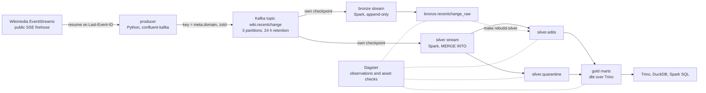

# Architecture

How the pieces fit, why the graph has the shape it has, and what would change if the
same design ran on managed cloud services instead of on one laptop.

This page is about structure. The guarantees each stage provides are in
[correctness.md](correctness.md), the column-level contracts are in
[data-contracts.md](data-contracts.md), and what to do when a stage misbehaves is in
[runbook.md](runbook.md).

## The graph

Two things in that picture are worth stopping on, because both are choices rather
than defaults: **Kafka has two arrows out of it, not a chain**, and **bronze reaches
silver only through a dotted line**. Both are explained below.

## The pieces

Every box above is a container in `docker-compose.yml`, and every container is in
exactly one of four profiles so a reviewer can run a third of the stack when a third
is all they need.

| Service | Image | Profile | Role |
|---|---|---|---|
| `kafka` | `apache/kafka:4.1.2` | default | Single-broker KRaft. No ZooKeeper, no schema registry. |
| `minio` | `quay.io/minio/minio` | default | S3-compatible object store; the lakehouse bucket. |
| `mc-init` | `quay.io/minio/mc` | default | One-shot: creates the bucket, then exits 0. |
| `iceberg-rest` | `apache/iceberg-rest-fixture:1.10.1` | default | The Iceberg catalog. SQLite-backed, on a volume. |
| `spark` | built locally | default | Runs the two streaming queries and every maintenance script. |
| `trino` | `trinodb/trino:483` | `full`, `dbt` | The query engine dbt compiles against. |
| `dagster-webserver` | built locally | `full` | UI, job execution, asset checks. |
| `dagster-daemon` | built locally | `full` | Schedules, which ship stopped. |
| `dbt` | built locally | `dbt` | One-shot model builds. |
| `producer` | built locally | `producer` | The SSE reader. Runs as a restarting service. |

`make up-core` is the default profile: Kafka, MinIO, the catalog and Spark. That is
enough to ingest, land both Iceberg tables, and run the whole integration suite.
`make up` adds `full`. The `producer` profile is separate so that a test can drive a
bounded producer without the long-lived one competing for the same topic.

## The flow, stage by stage

**1. Source to producer.** One long-lived HTTP connection to
`stream.wikimedia.org/v2/stream/recentchange`, with a `User-Agent` naming this
project, because that is what Wikimedia asks of clients. Reconnects use
`Last-Event-ID` and back off from 1 s to a 60 s cap. Nothing is polled and nothing is
scraped.

**2. Producer to Kafka.** Each frame is published verbatim — no parsing, no
enrichment, no filtering — keyed on `meta.domain` so that all edits to one wiki land
in one partition in order. Compression is zstd; `docs/throughput.md` has the ratios
that decided it. The send buffer is capped at 64 MB rather than librdkafka's 1 GB
default, so a broker outage backpressures the reader instead of being absorbed
silently until the process dies.

**3. Kafka to bronze.** An append-only Structured Streaming query, 30-second trigger,
`startingOffsets=earliest` on a fresh checkpoint. It writes the raw frame alongside
best-effort extracted columns, and it never rejects a row: an unparseable frame lands
with null extractions and its payload intact. Bronze is the audit log — the answer to
"what actually arrived" — and it is the reason every other layer can be rebuilt.

**4. Kafka to silver.** A second, independent query that reads the same topic and
writes two tables. Rows that pass every expectation in
`wikistream.quality.expectations` are merged into `silver.edits` keyed on `event_id`;
rows that fail one land in `silver.quarantine` with the reason and their Kafka
coordinates. The MERGE is what makes the pipeline idempotent under replay, and
[correctness.md](correctness.md) is the argument for why that beats a watermarked
`dropDuplicates`.

**5. Silver to gold.** dbt compiles two staging views and five marts through Trino
against the same Iceberg tables Spark wrote. No extract, no copy, no sync job: Trino
reads the catalog Spark commits to and sees the current snapshot.

**6. Everything to Dagster.** The producer and the two streams are *external assets*
— real nodes with real edges, but not things Dagster starts. What Dagster does run is
observations of the three streaming tables, the dbt build, the gold maintenance job,
and the asset checks. `make dagster-observe` is the health command.

## Why Kafka has two arrows out of it

The obvious medallion shape is a chain: Kafka to bronze, bronze to silver. This
pipeline does not do that. The silver stream is a second consumer of the same topic,
with its own checkpoint, and it never reads bronze in the streaming path.

| | chain (bronze → silver) | two consumers (what this does) |
|---|---|---|
| Silver's freshness | bounded by bronze's slowest batch | independent of bronze |
| A bronze failure | stalls silver too | silver keeps running |
| Reprocessing silver | read bronze — cheap, already in Iceberg | read bronze via `make rebuild-silver` — same thing, but a separate script |
| Parse logic | written once | written once, in `wikistream.streaming`, shared by both paths |
| Kafka read traffic | one consumer | two consumers over the same 24 h retention |
| Row counts | silver ≤ bronze, always | either can be ahead; comparing them proves nothing |

The last row is the one that changes how the system is monitored. Because the two
queries commit independently, `bronze` and `silver` legitimately disagree at any
instant, so no asset check compares their totals — `bronze_offsets_are_contiguous`
checks bronze against *Kafka's* offsets, and `silver_edits_are_fresh` checks silver
against the clock. A check that asserted `count(bronze) == count(silver)` would fail
several times an hour while nothing was wrong, which is the fastest way to teach a
team to ignore a dashboard.

Bronze still reaches silver — through `make rebuild-silver`, the dotted arrow. That
path exists for reprocessing a window after a rule change or a mapping bug, and it is
the same `MERGE`, so running it while the stream runs is safe. Both are covered in
[runbook.md](runbook.md#7-backfilling-a-window).

## Where state lives, and what survives what

| State | Lives in | Survives `make down` | Survives `make clean` |
|---|---|---|---|
| Kafka log segments | `kafka-data` volume | yes | no |
| Table data and metadata | `minio-data` volume | yes | no |
| Catalog pointers (which metadata file is current) | `iceberg-catalog` volume, SQLite | yes | no |
| Streaming checkpoints and offsets | `spark-checkpoints` volume | yes | no |
| Dagster run history and check results | `dagster-home` volume | yes | no |
| dbt artefacts (`target/`, `logs/`) | bind mount into the repo, gitignored | yes | yes |

That table is the restart story in one place. `make down && make up` resumes both
streams from their checkpoints with no duplicates and no gap, which is what
`make test-e2e` proves under a hard kill. `make clean` is the only command that
destroys data, and it says so before it runs.

The catalog deserves one line of its own: it holds nothing but a pointer per table to
the current metadata file. Losing it does not lose data — the Parquet and the metadata
JSON are still in the bucket — but it does lose the ability to find it without
re-registering each table by hand. That is why it is on a volume rather than in the
fixture image's default in-memory mode.

## Who owns which table

| Layer | Written by | Read by | Never written by |
|---|---|---|---|
| `bronze.recentchange_raw` | the bronze stream | rebuild script, ad-hoc queries | dbt, Trino, Dagster |
| `silver.edits`, `silver.quarantine` | the silver stream, `rebuild_silver.py` | dbt, Trino, DuckDB | dbt |
| `gold.*` | dbt | Trino, DuckDB, the asset checks | Spark |

The boundary is deliberate: Spark owns the streaming layer because it is the engine
that can do exactly-once commits into Iceberg, dbt owns the analytics layer because
that is where SQL, tests and documentation belong together, and neither writes into
the other's tables. Iceberg is what makes the split possible without a copy — three
engines read the same files through the same catalog, which is the interoperability
claim `make query` and `make query-duckdb` back up by producing the same numbers from
two different runtimes.

## The same pipeline on AWS

`infra/aws/` expresses this architecture as managed services. It has never been
applied — [its README](../infra/aws/README.md) opens by saying so, and CI validates
it with no credentials and no state. What follows is the substitution table plus the
two client-side changes the module cannot express, because they live in this
repository's own configuration rather than in infrastructure.

| Local | AWS | Why that service |
|---|---|---|
| Kafka, single broker | MSK Serverless, SASL/IAM only | Same protocol, so the streaming code is unchanged. Serverless because a laptop-scale topic does not justify sizing brokers. |
| MinIO | Two S3 buckets | One for the lakehouse, one for access logs. |
| Iceberg REST catalog | Glue Data Catalog | Everything on AWS that reads Iceberg already speaks Glue; Athena speaks nothing else. |
| Spark on one container | EMR Serverless | Streaming job held continuously, not a per-query cluster. |
| Trino | Athena | Athena *is* Trino, and needs no infrastructure beyond a workgroup. |
| Dagster | nothing | There is no managed Dagster. `k8s/` is where that story goes. |

### What changes in the Spark catalog configuration

This is the one component with no local equivalent, so the configuration genuinely
differs rather than differing by an endpoint. The local properties come from
`wikistream.streaming.session.catalog_properties`:

| Property (`spark.sql.catalog.lakehouse…`) | Local | On Glue |
|---|---|---|
| *(the catalog class)* | `org.apache.iceberg.spark.SparkCatalog` | unchanged |
| `.type` | `rest` | **removed** |
| `.uri` | `http://iceberg-rest:8181` | **removed** |
| `.catalog-impl` | — | `org.apache.iceberg.aws.glue.GlueCatalog` |
| `.warehouse` | `s3://lakehouse/warehouse` | the bucket the module creates |
| `.io-impl` | `org.apache.iceberg.aws.s3.S3FileIO` | unchanged |
| `.s3.endpoint` | `http://minio:9000` | **removed** — real S3 needs no endpoint override |
| `.s3.path-style-access` | `true` | **removed** — MinIO serves bucket-in-path, S3 does not need it |
| `.s3.access-key-id`, `.s3.secret-access-key` | MinIO's local defaults | **removed** — the EMR job role supplies credentials |
| `.client.region` | `us-east-1` (MinIO ignores it) | the module's region, `eu-central-1` by default |

Five of the ten properties exist only because MinIO is not S3, which is a fair
summary of how much of a local lakehouse is scaffolding. The catalog *name* is a
client-side property, so keeping it `lakehouse` keeps every table identifier in every
query and every dbt model byte-identical; `modules/glue/main.tf` spells it
`glue_catalog` in its comment because that is the convention in AWS documentation,
not because the name has to change.

### What changes in the dbt profile

`dbt/profiles.yml` targets Trino. Athena is a different adapter, so the profile is
rewritten while the models are not:

| dbt-trino (local) | dbt-athena | Note |
|---|---|---|
| `type: trino` | `type: athena` | Different adapter package. |
| `method: none`, `host`, `port`, `http_scheme`, `user` | — | Athena authenticates with SigV4 from the environment; there is no host to name. |
| `catalog: lakehouse` | `database: awsdatacatalog` | Athena's name for the Glue catalog it queries. |
| `schema: gold` | `schema: gold` | Unchanged — the Glue database the module creates. |
| — | `s3_staging_dir`, `region_name`, `work_group` | The three Athena-specific values. The workgroup and the results prefix are what `infra/aws/README.md` calls a three-line substitution. |
| `threads: 4`, `timezone: UTC` | same | Unchanged. |
| `prepared_statements_enabled: true` | — | No analogue; it only changes how dbt-trino reports a syntax error. |

The model *bodies* port unchanged, and the model *configs* do not: the five gold
models set Iceberg table properties through dbt-trino's `properties={'partitioning':
…, 'sorted_by': …}` block, and dbt-athena spells the same intent with
`table_type='iceberg'` and `partitioned_by=[…]`. So the SQL is portable and the
config blocks need translating — which is exactly the kind of detail that a
"multi-cloud" claim usually hides. This substitution is read off the two adapters'
configuration surfaces; it has not been executed, and the repository does not pretend
otherwise.

### What does not port at all

- **The Iceberg REST fixture.** It is a development container by its own project's
  description. Glue replaces it; there is no lift-and-shift.
- **Dagster.** Covered above: `k8s/` and a container platform, or a paid hosted
  product. Neither is in scope for a repository that must cost nothing to run.
- **`make test-e2e` as written.** It kills the streaming job with `pkill -9` inside
  the Spark container and restarts it there. The proof it establishes — restart without
  duplicates — ports to MSK unchanged, because MSK is Kafka; what would have to be
  rewritten is the harness, not the argument.

## And on GCP

The measured job-advert sample this project was designed against asks for
GCP/BigQuery about as often as it asks for AWS, so it is worth being explicit: there
is no GCP implementation here, and there is not going to be a second Terraform module
pretending otherwise. The honest version is the substitution reasoning.

| Component | GCP counterpart | The catch |
|---|---|---|
| Kafka | Pub/Sub, or Managed Service for Kafka | Pub/Sub has no offsets. Subscriptions acknowledge messages; replay is `seek` to a timestamp or a snapshot. |
| MinIO | Cloud Storage | Iceberg's `GCSFileIO` in place of `S3FileIO`. |
| Iceberg REST catalog | BigLake Metastore | The same substitution shape as Glue: `catalog-impl` changes, identifiers do not. |
| Spark | Dataproc, or Dataproc Serverless | Structured Streaming code unchanged. |
| Trino | BigQuery reading Iceberg on GCS | The SQL dialect changes, so the marts would need porting. |
| Dagster | same problem as on AWS | — |

One of those rows matters more than the rest. `bronze_offsets_are_contiguous` — the
check that proves no record was lost between the queue and the table — is written
against Kafka's per-partition offsets, and **Pub/Sub has nothing equivalent**. A
Pub/Sub version of this pipeline would keep the deduplication guarantee, because that
lives in the Iceberg `MERGE` rather than in the queue, and would lose the completeness
check, because there is no monotonic sequence to compare a row count against. Managed
Service for Kafka keeps both. That is a design consequence of a queue choice, and
naming it is more useful than a second implementation would be.

## Limitations of the shape itself

- **Single node everywhere.** Spark is `local[*]`, Kafka is one broker, MinIO is one
  node. Nothing here demonstrates a rebalance, a failover or a shuffle across a
  network, and those are where distributed systems get interesting.
- **One topic, three partitions.** Partition skew is real and measured —
  `make explain-partitions` shows one partition taking most of the traffic, because
  keying on `meta.domain` means English Wikipedia is one key. That is the correct
  trade for per-wiki ordering, and it is a trade.
- **The gold layer is small.** Five marts over one silver table. The architecture
  would not change with fifty, but nothing in this repository proves that.
- **No CDC, no upstream database.** The source is an event stream, so there is no
  change-capture story here at all. It would be a different project.
